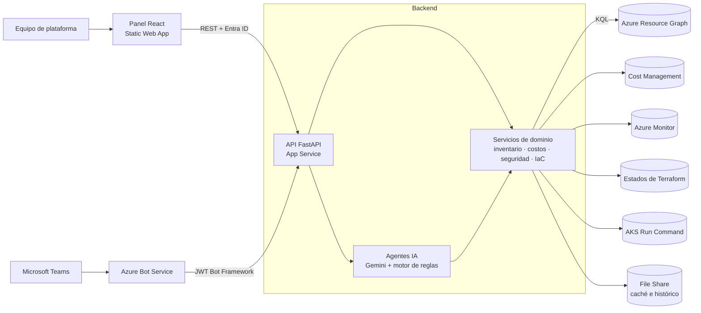

# CloudOps Copilot

[](https://github.com/miguelortiz13/cloudops-copilot/actions/workflows/ci.yml)


**Copiloto de operaciones cloud para Azure.** Reúne en un solo panel, y en un chat con agentes de IA, las preguntas que un equipo de plataforma se hace todos los días:

- **¿Qué tenemos?** Inventario multi-suscripción en tiempo real, con cumplimiento de tags y candidatos a Shadow IT.
- **¿Cuánto cuesta y dónde se desperdicia?** FinOps sobre la factura real de Cost Management, no sobre tarifas supuestas.
- **¿Qué está expuesto?** Hallazgos de seguridad ordenados por severidad y por el dinero que hay detrás.
- **¿Qué está codificado?** Cobertura real de Terraform leída de los estados, y generación de HCL para importar lo que falta.
- **¿Qué le pasa al clúster?** Diagnóstico de AKS con un agente SRE.

Todo con una identidad de **solo lectura** sobre el tenant: la plataforma observa y recomienda; los cambios los aprueba y aplica una persona.

---

## Arquitectura en una imagen



Detalle completo en [docs/architecture.md](docs/architecture.md).

## Inicio rápido

```bash
git clone git@github.com:miguelortiz13/cloudops-copilot.git
cd cloudops-copilot
make setup                 # virtualenv + npm ci + backend/.env desde el ejemplo
# completar backend/.env con un Service Principal de solo lectura
make dev                   # API en :8000, panel en :5173
```

O con Docker: `docker compose up --build` (API en `:8000`, panel en `:8080`).

Sin credenciales de Azure la plataforma arranca igual y responde en modo degradado; sin `GEMINI_API_KEY` el chat usa el motor de reglas local. Guía completa en [docs/getting-started.md](docs/getting-started.md).

## Módulos

| Módulo | Qué resuelve | Documento |
|---|---|---|
| Inventario y gobernanza | KPIs agregados en Resource Graph, matriz de tags, Shadow IT con regla de cuatro señales, histórico diario | [inventory-governance.md](docs/modules/inventory-governance.md) |
| FinOps | Huérfanos, showback por tag, anomalías, presupuestos y right-sizing sobre gasto facturado | [finops.md](docs/modules/finops.md) |
| SecOps | NSG, storage, Key Vault, SQL, HTTPS; exposición priorizada por severidad × gasto | [secops.md](docs/modules/secops.md) |
| IaC | Cobertura real desde los estados de Terraform y generador de HCL con `import {}` | [iac.md](docs/modules/iac.md) |
| Agentes de IA | Chat de inventario, FinOps y SecOps con contexto acotado y reglas compartidas | [ai-agents.md](docs/modules/ai-agents.md) |
| Kubernetes SRE | Salud, incidentes y logs de AKS con comandos validados | [kubernetes-sre.md](docs/modules/kubernetes-sre.md) |
| Teams | Bot conversacional y reportes proactivos | [teams.md](docs/integrations/teams.md) |

## Estructura del repositorio

```
cloudops-copilot/
├── backend/                  API FastAPI
│   ├── app/
│   │   ├── core/             configuración central y contenedor de servicios
│   │   ├── agents/           agente Azure (chat) y generador de IaC
│   │   ├── routers/          endpoints REST por módulo
│   │   ├── services/         lógica de dominio (inventario, costos, seguridad...)
│   │   └── schemas/          modelos Pydantic
│   ├── pipelines/inventory/  pipeline semanal de inventario a Excel
│   └── tests/                unitarias (sin Azure) e integración (tenant real)
├── frontend/                 panel React + TypeScript + Vite
├── infra/terraform/          infraestructura de la plataforma en Azure
├── integrations/teams-bot/   manifiesto de la app de Teams
├── scripts/                  dev, bootstrap del estado, deploy y destroy
└── docs/                     documentación
```

## Documentación

Empieza por el [índice de documentación](docs/README.md). Lo más consultado:

- [Configuración](docs/configuration.md): todas las variables de entorno.
- [Despliegue en Azure](docs/deployment.md): permisos, Terraform y publicación.
- [API](docs/api.md): catálogo de endpoints.
- [Seguridad](docs/security.md): modelo de amenazas y controles.
- [Roadmap](docs/roadmap.md): lo que falta para llevarlo a producción.

## Comandos útiles

```bash
make help            # lista de objetivos
make test            # 84 pruebas unitarias, sin tocar Azure
make lint            # ruff + eslint
make tf-validate     # terraform validate sin backend remoto
make deploy          # infraestructura + backend + frontend en Azure
```

## Licencia

[MIT](LICENSE) © 2026 Miguel Ortiz
