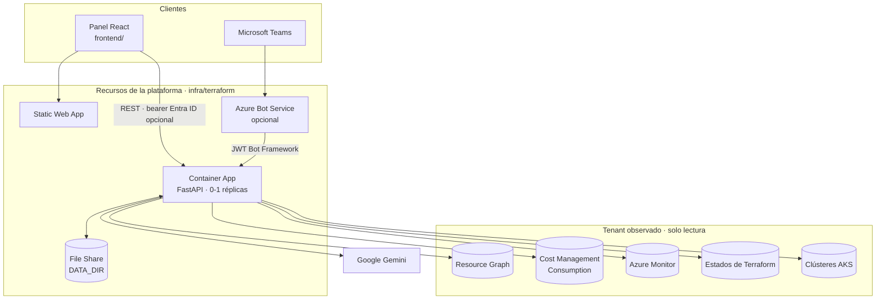
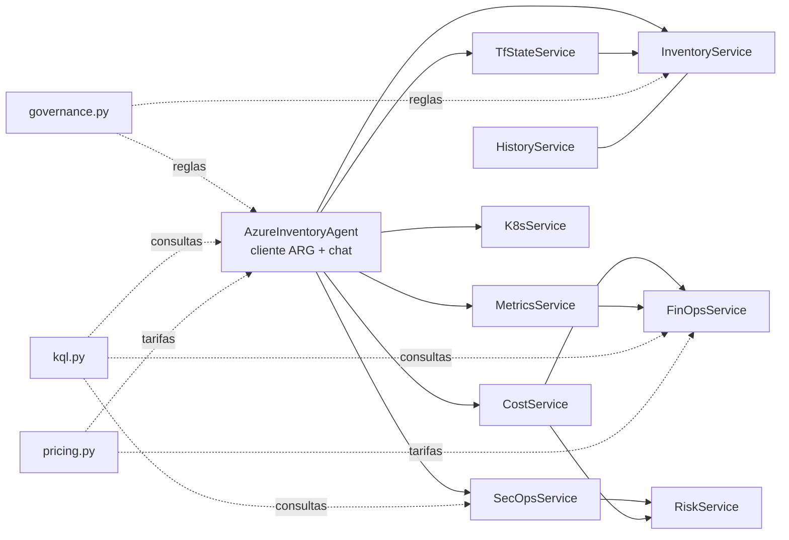
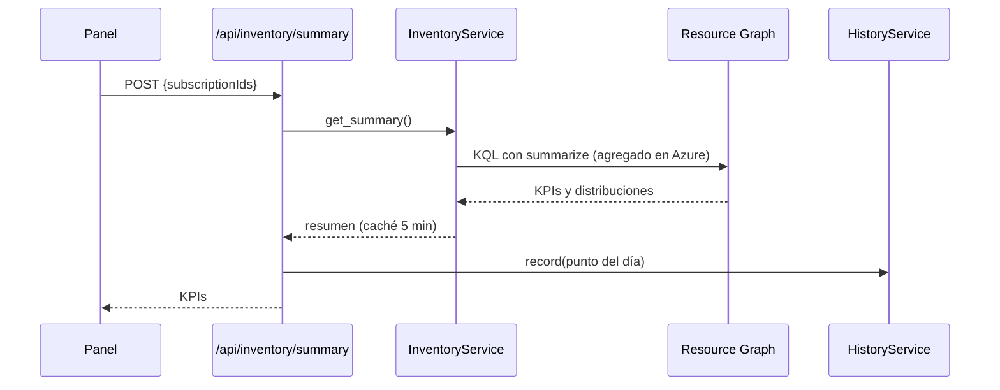
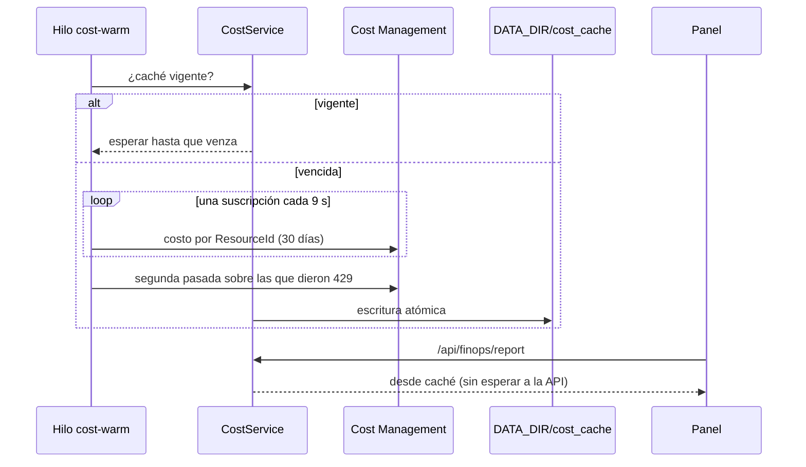

# Arquitectura

## Vista de componentes



| Componente | Tecnología | Responsabilidad |
|---|---|---|
| Panel | React 19, TypeScript, Vite, MSAL | Vistas de inventario, FinOps, SecOps, IaC, ISO, Kubernetes y chat |
| API | FastAPI, Python 3.12 | Endpoints REST, autenticación, orquestación de servicios |
| Servicios | Azure SDK + REST | Consultas KQL, costos, métricas, estados de Terraform, AKS |
| Agentes | Gemini + motor de reglas | Respuestas en lenguaje natural sobre el contexto del tenant |
| Pipeline | Scripts Python + bash | Exportación semanal del inventario a un Excel maestro con snapshots |
| Infraestructura | Terraform (azurerm 5.x, azuread 3.x) | Container Apps, Static Web App, identidad administrada, Entra ID, almacenamiento |

## Backend por capas

```
app/main.py            ← crea FastAPI, middlewares (auth, CORS) e incluye routers
app/core/config.py     ← única fuente de configuración (lee .env)
app/core/container.py  ← crea los servicios una vez y los comparte; precarga de costos
app/routers/*          ← traducen HTTP ↔ servicios; sin lógica de dominio
app/services/*         ← lógica de dominio
app/agents/*           ← agente conversacional y generador de IaC
app/schemas/*          ← contratos Pydantic
```

### Servicios y dependencias



- **`AzureInventoryAgent`** encapsula la autenticación (Service Principal o `DefaultAzureCredential`) y el cliente de Resource Graph con paginación por `skip_token`. Además responde el chat.
- **El agente recibe los mismos servicios que el panel** (`attach_services`): comparte su caché y, sobre todo, sus reglas. Ver [ADR 0002](adr/0002-una-definicion-por-regla.md).
- **Los servicios se crean de forma perezosa** en la primera petición (`container.get_services`), para que el arranque no dependa de que Azure responda.

### Módulos de reglas compartidas

| Módulo | Define |
|---|---|
| `services/governance.py` | Evidencia de IaC, custodio, recursos derivados, Shadow IT, expresiones KQL equivalentes |
| `services/kql.py` | Catálogo de consultas de dominio (huérfanos, exposición, etc.) |
| `services/pricing.py` | Tarifas de referencia para estimaciones cuando no hay facturación |
| `core/config.py` | Tags obligatorias, dimensiones de showback, nombre de la organización |

## Flujos principales

### Resumen de inventario



Los KPIs se calculan **en Resource Graph**, no descargando el inventario: el tiempo de respuesta deja de crecer con el tamaño del tenant (~1,3 s tanto con 600 como con 10.000 recursos). La implementación en memoria se conserva como referencia y respaldo, y `tests/integration/test_inventory_kpis.py` verifica que ambos caminos producen los mismos números.

### Costos con precarga



Cost Management limita la tasa con dureza (`429`). La precarga va en segundo plano y pausada, y la caché se persiste en `DATA_DIR` para que un reinicio no gaste la cuota de nuevo. Ver [ADR 0003](adr/0003-cache-de-costos-persistente.md).

### Chat

1. El router identifica el agente (`inventory`, `finops`, `secops`).
2. El agente arma el contexto con consultas paralelas bajo un **presupuesto de tiempo único** (25 s); lo que no llega se declara en `consultas_incompletas`.
3. Las listas viajan **acotadas** (`{muestra, total, truncado}`) para que el modelo diga "hay 212, te muestro 15".
4. Si Gemini no está disponible o falla, responde el **motor de reglas** con los mismos datos.

## Persistencia

La plataforma no usa base de datos. Lo que debe sobrevivir a un reinicio va a `DATA_DIR` (un File Share en Azure, `backend/data` en local):

| Ruta | Contenido | Escribe |
|---|---|---|
| `cost_cache/` | Gasto por recurso, por scope | `CostService` |
| `kpi_history/` | Un punto diario de KPIs (JSON Lines, ~300 B/día) | `HistoryService` |
| `Azure_IaC_Inventario.xlsx` | Excel maestro del pipeline | pipeline de inventario |
| `snapshots/` | Copias semanales y logs del pipeline | pipeline de inventario |
| `teams_session.json` | Conversación para reportes proactivos | webhook de Teams |

## Decisiones de diseño

Las decisiones relevantes están registradas como ADR en [docs/adr](adr/README.md).
