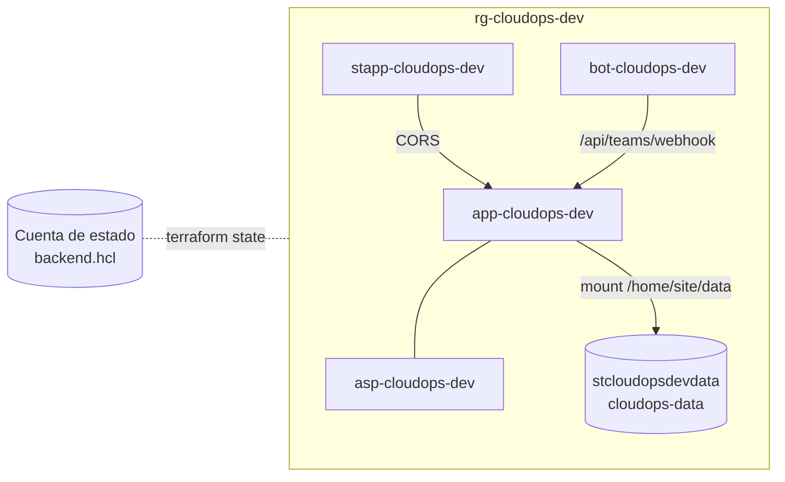

# Despliegue en Azure

## Recursos que se crean

`infra/terraform` despliega la plataforma en un grupo de recursos propio. Los nombres se derivan de `name_prefix` y `environment` (por defecto `cloudops` y `dev`):

| Recurso | Nombre | Notas |
|---|---|---|
| Resource Group | `rg-cloudops-dev` | |
| App Service Plan Linux | `asp-cloudops-dev` | SKU `B1` por defecto |
| Linux Web App (API) | `app-cloudops-dev` | Python 3.12, HTTPS obligatorio, FTPS desactivado |
| Storage Account + File Share | `stcloudopsdevdata` / `cloudops-data` | Montado en `/home/site/data` como `DATA_DIR` |
| Static Web App (panel) | `stapp-cloudops-dev` | SKU Free |
| Azure Bot + canal Teams | `bot-cloudops-dev` | Opcional (`enable_teams_bot`) |



## Permisos

### Identidad que despliega (tú o el pipeline)

- `Contributor` sobre la suscripción de destino (o sobre un RG pre-creado).
- `Storage Blob Data Contributor` sobre la cuenta del estado de Terraform.
- Permiso para crear App Registrations si vas a crear el bot desde cero.

### Identidad de la plataforma (en tiempo de ejecución)

| Rol | Alcance | Necesario para |
|---|---|---|
| `Reader` | Suscripciones o management group observados | Inventario, SecOps, IaC, ISO y costos con alcance de suscripción |
| `Cost Management Reader` | Opcional | Costos en alcances superiores, o si la organización restringe la visibilidad de cargos |
| `Monitoring Reader` | Opcional | CPU real de VMs para right-sizing (con `Reader` suele bastar) |
| `Storage Blob Data Reader` | Cuenta de estados de Terraform | Cobertura real de IaC (`TFSTATE_ACCOUNT`) |
| `Azure Kubernetes Service Cluster User Role` + permiso de Run Command | Clúster AKS | Agente SRE |

> Verificado en la práctica: para consultas de costo con alcance de suscripción, `Reader` es suficiente. La plataforma no lo asume: detecta la cobertura real en ejecución y la reporta.

## Paso a paso

### 1. Estado de Terraform (una sola vez)

```bash
SUBSCRIPTION_ID=<id> ./scripts/bootstrap-state.sh
```

Crea `rg-tfstate`, una cuenta de almacenamiento y el contenedor `tfstate`, te asigna permisos de datos y escribe `infra/terraform/backend.hcl`. Si tu organización ya tiene una cuenta de estado, copia `backend.hcl.example` y complétalo.

### 2. Variables

```bash
cp infra/terraform/terraform.tfvars.example infra/terraform/terraform.tfvars
```

Completa suscripción, tenant, organización y credenciales. Los secretos también pueden pasarse como `TF_VAR_bot_app_password`, `TF_VAR_gemini_api_key`, etc., para no escribirlos en disco.

### 3. Desplegar

```bash
make deploy                 # o ./scripts/deploy.sh
AUTO_APPROVE=1 make deploy  # sin confirmación interactiva (CI)
```

El script:

1. `terraform init` + `apply` con `backend.hcl`.
2. Lee los outputs (`api_app_name`, `api_url`, `static_web_app_api_key`...).
3. Empaqueta `backend/app`, `backend/pipelines` y `requirements.txt`, y **aborta si falta algún paquete** (un paquete ausente en el zip produce un 500 silencioso en App Service).
4. Publica el backend con `az webapp deploy`.
5. Compila el panel con `VITE_API_URL` apuntando al API y lo publica en la Static Web App.

El primer arranque del App Service tarda varios minutos: instala dependencias durante el despliegue. `WEBSITES_CONTAINER_START_TIME_LIMIT=1800` evita que se marque como fallido.

### 4. Verificar

```bash
terraform -chdir=infra/terraform output
curl -s "$(terraform -chdir=infra/terraform output -raw api_url)/api/inventory/health"
```

### 5. Teams (opcional)

Ver [integrations/teams.md](integrations/teams.md).

## Destruir

```bash
make destroy    # pide escribir "destruir"
```

**Elimina también la cuenta de datos** (caché de costos, histórico de KPIs, Excel y snapshots). Descarga lo que quieras conservar antes. El estado de Terraform no se toca.

## Costo aproximado

Con los valores por defecto, el costo fijo es el del App Service Plan `B1` (~13 USD/mes en `eastus2`) más almacenamiento marginal. Static Web App y Bot Service usan SKU gratuitos. Los precios cambian; verifica en la calculadora de Azure.

## Despliegue en contenedores

`backend/Dockerfile` y `frontend/Dockerfile` permiten desplegar en Azure Container Apps, AKS u otra plataforma. Monta un volumen persistente en `/data` para el backend y compila el frontend con `--build-arg VITE_API_URL=<url del API>`.
