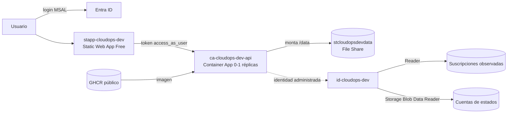

# Despliegue en Azure

La plataforma se despliega con un diseño de **costo cercano a cero**: el API escala a cero réplicas cuando nadie lo usa, el panel es una Static Web App gratuita y no hay ningún secreto de Azure en la configuración, porque la identidad es administrada.

## Recursos que se crean

`infra/terraform` crea todo en `rg-<prefijo>-<ambiente>` (por defecto `rg-cloudops-dev`):

| Recurso | Nombre | Notas | Costo |
|---|---|---|---|
| Container Apps Environment | `cae-cloudops-dev` | Consumo, sin Log Analytics | $0 |
| Container App (API) | `ca-cloudops-dev-api` | 0,5 vCPU / 1 GiB, **0 a 1 réplicas** | $0 dentro del cupo gratuito mensual |
| Identidad administrada | `id-cloudops-dev` | Reader, Storage Blob Data Reader | $0 |
| Identidad de despliegue | `id-cloudops-dev-deploy` | Contributor solo sobre el grupo de recursos; credencial federada para GitHub Actions | $0 |
| Storage Account + File Share | `stcloudopsdevdata` / `cloudops-data` (1 GB) | Montado en `/data` (`DATA_DIR`) | centavos |
| Static Web App (panel) | `stapp-cloudops-dev` | SKU Free | $0 |
| App registrations (Entra ID) | `CloudOps Copilot API (dev)` y `CloudOps Copilot (dev)` | Acceso solo para usuarios asignados | $0 |

Fuera del grupo:

- **Estado de Terraform**: `rg-cloudops-tfstate`, creado por `scripts/bootstrap-state.sh`. Cuesta centavos al mes.
- **Imagen del API**: pública en GitHub Container Registry (`ghcr.io/miguelortiz13/cloudops-copilot-api`), construida por la CI. Sin costo y sin credenciales para descargarla.



## Por qué Container Apps

| Opción | Costo fijo mensual | Notas |
|---|---|---|
| App Service B1 | ~13 USD | Siempre encendido |
| App Service F1 | 0 | 60 min de CPU al día, sin montar Azure Files |
| Functions Flex Consumption | ~0 | Requiere adaptar FastAPI y no admite hilos en segundo plano |
| **Container Apps (consumo)** | **0** | Escala a cero, monta Azure Files, imagen Docker estándar |

El costo de escalar a cero es el **arranque en frío**: la primera petición tras un rato sin uso tarda unos segundos en levantar el contenedor. La caché de costos persistida en `/data` evita que cada arranque consuma la cuota de Cost Management.

## Permisos

### Quien despliega

- `Owner` (o `Contributor` + `User Access Administrator`) sobre la suscripción de despliegue y sobre las suscripciones observadas, porque Terraform crea asignaciones de rol.
- Permiso para crear app registrations en Entra ID; un usuario normal lo tiene por defecto.

### La plataforma (identidad administrada `id-<base>`)

| Rol | Alcance | Para |
|---|---|---|
| `Reader` | Cada suscripción de `observed_subscription_ids` | Inventario, SecOps, IaC y costos con alcance de suscripción |
| `Storage Blob Data Reader` | Cada cuenta de `tfstate_sources` | Cobertura real de IaC |

Ningún rol permite escribir en los recursos observados.

## Paso a paso

### 1. Preparar la suscripción (una sola vez)

```bash
SUBSCRIPTION_ID=<id> ./scripts/bootstrap-state.sh
```

Registra los proveedores (`Microsoft.App`, `Microsoft.Web`...), crea la cuenta del estado, te asigna permisos de datos sobre ella y escribe `infra/terraform/backend.hcl`.

### 2. Variables

```bash
cp infra/terraform/terraform.tfvars.example infra/terraform/terraform.tfvars
```

Completa:

- la suscripción de despliegue;
- las suscripciones a observar;
- las cuentas de estados de Terraform (incluida la de la propia plataforma, para que se reconozca como gestionada);
- tu nombre en `org_name`.

La clave de Gemini, si la usas, mejor como variable de entorno: `export TF_VAR_gemini_api_key=...`.

### 3. Desplegar

Hay dos caminos, con responsabilidades separadas:

| Qué cambia | Cómo se despliega |
|---|---|
| Código (API y panel) | **Automático**: cada merge a `main` dispara el workflow [`cd.yml`](../.github/workflows/cd.yml) |
| Infraestructura (Terraform) | **Manual**: `terraform apply` o `make deploy` |

La separación es deliberada: la identidad del despliegue continuo solo puede actualizar la imagen y el panel dentro del grupo de recursos; no puede asignar roles, crear app registrations ni tocar las suscripciones observadas. Darle esos permisos a un pipeline sería el punto más débil de la plataforma.

#### Despliegue continuo (GitHub Actions)

1. **Imagen**: se construye y publica en GHCR con la etiqueta del commit (en los PRs, `pr-N`, sin desplegar).
2. **API**: `az containerapp update` con esa imagen; espera a que la revisión quede aprovisionada y sana.
3. **Panel**: se compila con la configuración de Entra ID y se publica en la Static Web App.
4. **Prueba de humo**: health 200, API sin token 401, panel 200 y cabecera CSP presente.

Se autentica en Azure por OIDC con la identidad `id-cloudops-dev-deploy` ([`cicd.tf`](../infra/terraform/cicd.tf)), sin secretos de larga vida. El ambiente `dev` de GitHub solo acepta despliegues desde `main` y guarda como secretos los IDs de tenant, suscripción e identidad, para que no aparezcan en los logs públicos.

Configuración del ambiente `dev` en GitHub:

| Tipo | Nombre | Valor |
|---|---|---|
| Secreto | `AZURE_CLIENT_ID` | `terraform output -raw deploy_client_id` |
| Secreto | `AZURE_TENANT_ID` / `AZURE_SUBSCRIPTION_ID` | Tenant y suscripción de despliegue |
| Secreto | `VITE_API_URL` / `VITE_AZURE_AD_CLIENT_ID` / `VITE_API_SCOPE` | Outputs `api_url`, `spa_client_id`, `api_scope` |
| Variable | `RESOURCE_GROUP` / `CONTAINER_APP` / `STATIC_WEB_APP` | Nombres de los recursos |
| Variable | `USER_DISPLAY_NAME` | Nombre que muestra el panel |

#### Despliegue manual

```bash
make deploy                                                    # pide confirmar el plan
AUTO_APPROVE=1 make deploy                                     # sin confirmación
API_IMAGE=ghcr.io/miguelortiz13/cloudops-copilot-api:<commit> make deploy   # una versión concreta
```

`scripts/deploy.sh` aplica Terraform, actualiza la imagen (por defecto, la última de `main`), compila y publica el panel y espera a que el API responda. Terraform ignora la imagen de la Container App después de crearla, para no deshacer lo que despliega el CD.

### 4. Verificar

```bash
./scripts/smoke-test.sh
```

Obtiene un token con tu sesión de Azure CLI, que está preautorizada en el API (`allow_azure_cli`), recorre los módulos principales y comprueba que una petición sin token reciba `401`.

Después abre la URL del panel (`terraform -chdir=infra/terraform output frontend_url`) e inicia sesión con tu cuenta.

### Logs

Sin Log Analytics, los logs se leen en vivo:

```bash
az containerapp logs show -g rg-cloudops-dev -n ca-cloudops-dev-api --follow
```

## Dar acceso a otra persona

Agrega su object id a `allowed_user_object_ids` y vuelve a aplicar. Sin asignación, Entra ID rechaza el inicio de sesión, tanto en el panel como desde la CLI.

## Destruir

```bash
make destroy    # pide escribir "destruir"
```

Borra el grupo de recursos (incluidos los datos persistidos), las app registrations y las asignaciones de rol. Se conservan el estado de Terraform y las imágenes en GHCR.

## Microsoft Teams

El bot no se aprovisiona por defecto en esta arquitectura. Ver [integrations/teams.md](integrations/teams.md).
