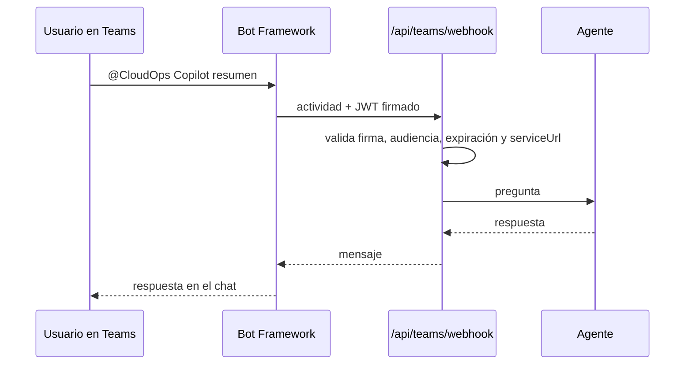

# Microsoft Teams

El bot lleva los agentes de la plataforma a Teams: responde preguntas en chats personales, de grupo y canales, y publica reportes proactivos del pipeline de inventario.



## Comandos

| Comando | Respuesta |
|---|---|
| `resumen` | Estado global: recursos, cobertura IaC, cumplimiento de tags |
| `dueño de <recurso>` | Custodio del recurso según sus tags |
| `tags-gaps` | Recursos que no cumplen la política de tags |
| `drift-terraform` | Recursos creados fuera de Terraform |
| Pregunta libre | Se responde con el agente de inventario |

## Configuración

### 1. Registro de aplicación

En Entra ID > App registrations, crea un registro **single tenant**. Guarda el *Application (client) ID* y crea un *client secret*. Son `bot_app_id` y `bot_app_password` en Terraform, y `MICROSOFT_APP_ID` / `AZURE_CLIENT_ID` / `AZURE_CLIENT_SECRET` en el backend.

### 2. Azure Bot

Con `enable_teams_bot = true` (valor por defecto), Terraform crea el Azure Bot `SingleTenant`, apunta su endpoint a `https://<api>/api/teams/webhook` y activa el canal de Teams. No hay pasos manuales en el portal.

### 3. Paquete de la app

```bash
cd integrations/teams-bot
BOT_APP_ID=<app id> \
BACKEND_HOST=app-cloudops-dev.azurewebsites.net \
DEVELOPER_NAME="Tu nombre" \
DEVELOPER_URL=https://tu-sitio.dev \
./package.sh
```

Genera `manifest.zip` desde `manifest.template.json` y los íconos. Cárgalo en Teams > Apps > Manage your apps > Upload a custom app (o publícalo en el catálogo de la organización).

## Desarrollo local

Bot Framework necesita alcanzar el webhook por HTTPS:

```bash
make dev                              # backend en :8000
ngrok http 8000                       # o: devtunnel host -p 8000
```

Cambia temporalmente el *messaging endpoint* del Azure Bot a `https://<túnel>/api/teams/webhook`. La validación del JWT sigue activa: el backend necesita `MICROSOFT_APP_ID` y acceso a internet para descargar las llaves públicas.

## Reportes proactivos

La primera vez que alguien escribe al bot, el backend guarda la conversación en `DATA_DIR/teams_session.json`. Al terminar el pipeline de inventario, publica ahí un resumen (recursos nuevos y eliminados, total, cumplimiento de tags) usando un token de Bot Framework obtenido con las credenciales del bot.

Alternativa sin bot: define `TEAMS_WEBHOOK_URL` con un webhook entrante (Workflows / Incoming Webhook) y el pipeline publicará una tarjeta en ese canal.

## Alertas de prueba

`POST /api/integration/test-webhook` con `{"webhook_url": "...", "alert_type": "inventory|finops|secops"}` envía una tarjeta con cifras reales del tenant. Útil para verificar el canal antes de automatizar alertas.
