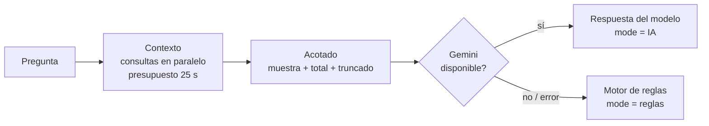

# Agentes de IA

Código: [`agents/azure_agent.py`](../../backend/app/agents/azure_agent.py), [`routers/chat.py`](../../backend/app/routers/chat.py).

## Agentes

| Agente | `agent_type` | Contexto que recibe |
|---|---|---|
| Inventario y gobernanza | `inventory` | Recursos, grupos, tipos, regiones, cumplimiento de tags, cobertura IaC, recursos sin custodio |
| FinOps | `finops` | Reporte de FinOps (huérfanos con costo real, showback, anomalías), tarifas de referencia |
| SecOps | `secops` | Reporte de SecOps y exposición priorizada |
| SRE Kubernetes | — (`/api/k8s/chat`) | Overview e incidencias del clúster; ver [kubernetes-sre.md](kubernetes-sre.md) |

Responden en español, con tablas comparativas y comandos `az` o `kubectl` exactos. Se presentan como agentes de `ORG_NAME`.

## Cómo se arma una respuesta

### Una sola definición por regla

Cada regla —qué es un disco huérfano, un Key Vault expuesto, un recurso gestionado por IaC— vive en `kql.py`, `governance.py` o `pricing.py`, y de ahí la leen el panel, los reportes y el chat. El agente **no consulta por su cuenta**: recibe los servicios del panel (`attach_services`) y hereda sus reglas y su caché.

Esto corrigió divergencias reales: el chat contaba como públicas todas las cuentas de almacenamiento mientras el panel filtraba por `allowBlobPublicAccess`, y el reporte de costo del chat publicaba estimaciones bajo una clave llamada "costo real". Ver [ADR 0002](../adr/0002-una-definicion-por-regla.md).

### Presupuesto de contexto

- **Tamaño:** cada lista viaja acotada y declara lo que quedó fuera (`{muestra, total, truncado}`). El modelo dice "hay 212, te muestro 15" en lugar de presentar una página como si fuera todo el inventario. El contexto de SecOps bajó de ~95.000 a ~21.000 caracteres.
- **Tiempo:** todas las consultas comparten un presupuesto único (`PRESUPUESTO_CONTEXTO_SEGUNDOS = 25`). Antes cada una tenía su propio timeout en serie y podían sumar más de 100 s, cerca del corte de 230 s del gateway de App Service. Lo que no llega se anota en `consultas_incompletas` y el resto se responde.

### Robustez

Un recurso sin tags llegaba al contexto como la cadena `"null"`; al deserializarse como `None`, el `.items()` siguiente fallaba dentro del `try` general y el chat respondía con el motor de reglas sin decirlo. Corregido en `_tags_como_dict`, con prueba de regresión en `tests/unit/test_contexto_agente.py`.

## Modelo

`GEMINI_MODEL` (por defecto `gemini-3.5-flash`). El SDK actual (`google-generativeai`) está en desuso; la migración a `google-genai` y la abstracción del proveedor de LLM están en el [roadmap](../roadmap.md).
