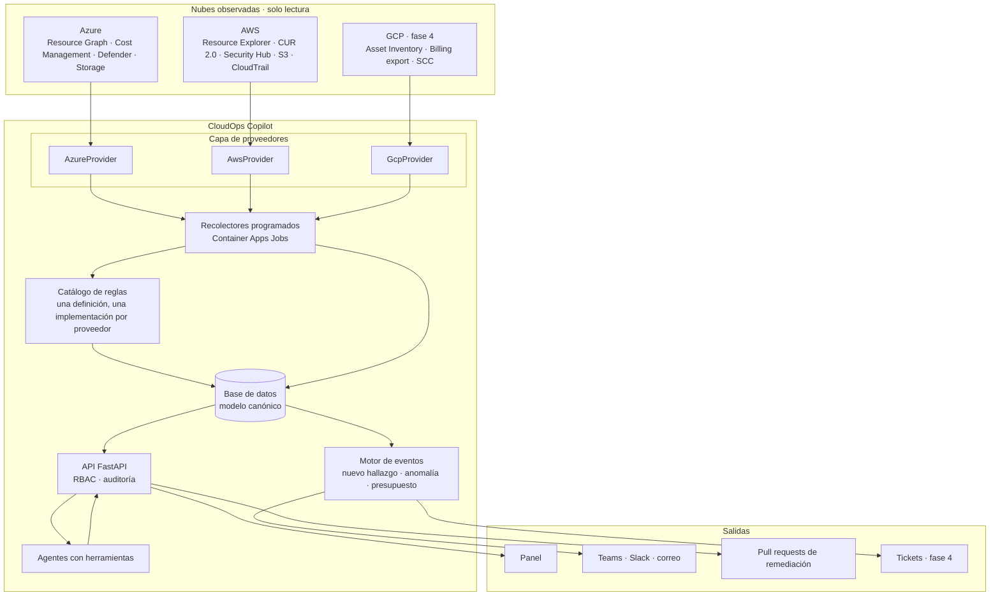
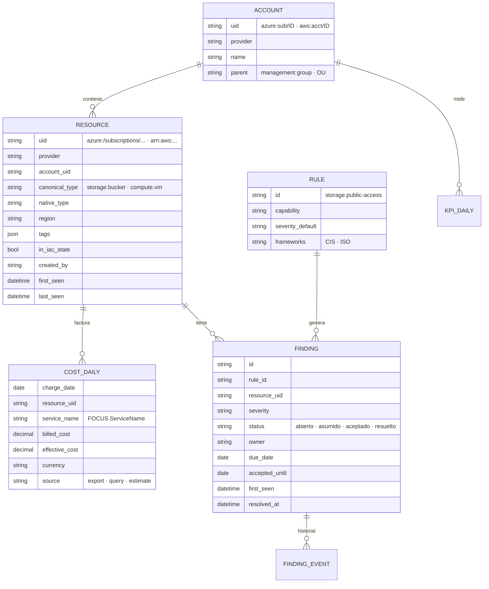

# 2. Arquitectura objetivo

## Vista general



Tres cambios estructurales respecto a hoy:

1. **Capa de proveedores**: cada nube se implementa detrás de las mismas interfaces. El resto del sistema no sabe de KQL ni de ARN.
2. **Recolectores fuera del API**: trabajos programados leen las nubes y escriben en la base de datos. El API responde desde ahí: rápido, sin límites de tasa en el camino de la petición y con historia.
3. **Base de datos con un modelo canónico**: recursos, costos (en formato FOCUS), hallazgos con ciclo de vida y métricas diarias.

## Capa de proveedores

Decisión registrada en [ADR 0006](../adr/0006-abstraccion-de-proveedores.md).

```
backend/app/providers/
├── base.py            Protocolos: InventoryProvider, CostProvider, SecurityProvider,
│                      IacStateProvider, ActivityProvider, KubernetesProvider
├── azure/             implementación actual, extraída de services/ y agents/
├── aws/               fase 2
└── registry.py        qué proveedores están configurados y con qué cuentas
```

| Interfaz | Responsabilidad | Azure (hoy) | AWS (fase 2) |
|---|---|---|---|
| `InventoryProvider` | Cuentas visibles; recursos normalizados; agregados | Resource Graph | Resource Explorer (+ Config para propiedades) |
| `CostProvider` | Costo por recurso y por día, en FOCUS | Cost Management Query / exports FOCUS | CUR 2.0 en FOCUS vía Athena; Cost Explorer como respaldo |
| `SecurityProvider` | Evaluar las reglas del catálogo; importar hallazgos nativos | KQL propio; Defender for Cloud (opcional) | Config / consultas propias; Security Hub CSPM |
| `IacStateProvider` | Listar y leer estados de Terraform (solo `id` y `type`) | Blob Storage | S3 |
| `ActivityProvider` | Quién creó cada recurso y cuándo | `resourcechanges` (~14 días) | CloudTrail (90 días de eventos de gestión) |
| `KubernetesProvider` | Clústeres; comandos `kubectl` de lectura | AKS Run Command | EKS (API de Kubernetes con acceso IAM) |

Reglas para las implementaciones:

- Devuelven **siempre** el modelo canónico, nunca estructuras nativas.
- Declaran sus capacidades: un proveedor puede no soportar algo (por ejemplo, `ActivityProvider` sin CloudTrail habilitado) y el panel lo dice en lugar de mostrar cero.
- Las credenciales las resuelve cada proveedor (identidad administrada en Azure; federación OIDC en AWS) y nunca salen de él.

## Modelo canónico



Decisiones clave del modelo:

- **Identificador universal (`uid`)** con prefijo de proveedor. Reemplaza el supuesto de que todo id empieza por `/subscriptions/`.
- **Tipos canónicos** (`storage.bucket`, `compute.vm`, `network.public_ip`, `secrets.vault`) con el tipo nativo al lado. Las reglas y los desgloses usan el canónico; el detalle muestra el nativo.
- **Costos en FOCUS** ([ADR 0008](../adr/0008-focus-como-modelo-de-costos.md)): es el estándar abierto que Azure y AWS ya exportan, así que la unificación de costos no es una traducción propia.
- **Hallazgos con estado e historia**: un hallazgo que desaparece en la siguiente recolección se marca *resuelto* con fecha; uno aceptado como riesgo vence en `accepted_until` y vuelve a abrirse.

## Recolectores

Decisión registrada en [ADR 0007](../adr/0007-almacen-de-datos-y-recolectores.md).

Los recolectores corren juntos en **una ventana diaria** (un solo job que los ejecuta en orden), más una reejecución manual para administradores. No es una limitación técnica sino de costo: la base de datos gratuita se pausa cuando nadie la usa, y un recolector cada hora la mantendría despierta todo el mes (ver [presupuesto de cómputo](05-infraestructura.md#presupuesto-de-cómputo-de-la-base-de-datos)).

| Recolector | Frecuencia | Qué hace | Por qué |
|---|---|---|---|
| `inventory` | Diaria (snapshot) | Recursos y tags de cada cuenta; marca altas y bajas con fecha | La vista de inventario **sigue consultando en vivo** (Resource Graph y Resource Explorer son rápidos y baratos); la base guarda la historia |
| `costs` | Diaria | Costo diario por recurso en FOCUS; recalcula los últimos 3 días | Las nubes consolidan una vez al día y corrigen días recientes |
| `findings` | Diaria + bajo demanda | Evalúa el catálogo de reglas; abre, actualiza o resuelve hallazgos | La vista de seguridad puede pedir una evaluación en vivo de una cuenta |
| `iac_states` | Diaria | Índice de ids gestionados por Terraform | Los estados cambian con despliegues, no por minuto |
| `activity` | Diaria | Creaciones con identidad (Azure `resourcechanges`, AWS CloudTrail) | La ventana de Azure es de ~14 días: guardar a diario no pierde eventos |
| `kpis` | Diaria | Punto diario de KPIs por cuenta | Reemplaza el JSONL que solo se escribía al abrir el panel |
| `events` | Al final de la ventana | Compara con el estado anterior y emite eventos | Las alertas salen de cambios, no de estados |

Si una organización necesita frescura horaria de hallazgos, la base de datos pasa a un plan de costo fijo (PostgreSQL B1ms, ~USD 13/mes) y la ventana se acorta: es configuración, no rediseño.

Cada recolector es **idempotente** (se puede reejecutar sin duplicar), registra su ejecución (inicio, fin, cuentas, errores) y el panel muestra la antigüedad del dato que pinta.

## Eventos y acciones

| Evento | Disparador | Destino por defecto |
|---|---|---|
| `finding.opened` (crítico) | Hallazgo nuevo de severidad crítica | Canal de seguridad |
| `cost.anomaly` | Gasto diario > media de 14 días + 3 desviaciones, o > 2× | Canal de FinOps |
| `budget.threshold` | Consumo o pronóstico ≥ 80 % / 100 % del presupuesto | Dueño del presupuesto |
| `resource.unmanaged_created` | Recurso creado por una persona y fuera de cualquier estado de Terraform | Canal de plataforma |
| `finding.acceptance_expired` | Vence una aceptación de riesgo | Dueño del hallazgo |
| `collector.failed` | Un recolector falla dos veces seguidas | Administradores |

Las notificaciones pasan por una interfaz `Notifier` (Teams, Slack, correo) con plantillas por evento y deduplicación: el mismo hallazgo no se notifica dos veces mientras siga abierto.

La acción principal es el **PR de remediación**: el generador de HCL (o un parche de Terraform para un recurso ya gestionado) se publica como pull request en el repositorio de infraestructura configurado, con el hallazgo enlazado. El PR lo revisa y lo aplica el equipo; la plataforma solo lee de vuelta el estado para cerrar el hallazgo.

## API y agentes

- **Dependencias explícitas**: `Depends()` de FastAPI en lugar de la tupla posicional `get_services()`.
- **Autorización por rol** (ver [documento 6](06-seguridad-calidad-operacion.md)): `lector`, `operador`, `administrador`.
- **Lectura desde la base de datos por defecto**; las consultas en vivo quedan para el detalle de un recurso y para el botón "actualizar ahora".
- **Agentes con herramientas**: en lugar de precargar todo el contexto, el modelo llama funciones tipadas (`buscar_recursos`, `costo_por`, `hallazgos`, `generar_hcl`) que son los mismos endpoints del API, con los permisos del usuario. Proveedor de LLM detrás de una interfaz (Gemini, Azure OpenAI o Claude), con el motor de reglas como respaldo.
