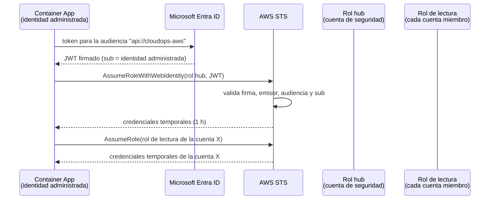

# 3. Multinube: AWS primero

## Objetivo

Que una organización con cuentas de AWS vea en CloudOps Copilot lo mismo que hoy ve de Azure —inventario, costos, seguridad, cobertura de IaC, actividad y Kubernetes—, **en las mismas pantallas y con las mismas reglas**, sin guardar una sola llave de AWS.

No se trata de "una pestaña de AWS": cada vista muestra todas las nubes, con un filtro por proveedor y por cuenta. El gasto total suma Azure y AWS; un hallazgo de "almacenamiento público" es la misma regla en ambos.

## Modelo de cuentas

| Escenario | Cómo se conecta | Cuándo |
|---|---|---|
| **Una cuenta** | Un rol de solo lectura en esa cuenta | Pruebas y tenants personales |
| **AWS Organizations** | Un rol *hub* en la cuenta de seguridad o administración, y un rol de lectura en cada cuenta miembro desplegado con CloudFormation StackSets | Cualquier organización real |

Con Organizations, la plataforma descubre las cuentas solas (`organizations:ListAccounts`) y respeta la jerarquía de OU igual que hoy respeta los management groups de Azure.

## Autenticación sin secretos

La plataforma ya corre con una identidad administrada en Azure. AWS acepta tokens de Microsoft Entra ID como proveedor OIDC, así que esa misma identidad puede asumir un rol de AWS: **no hay llaves de acceso que guardar, rotar o filtrar**.



Política de confianza del rol hub (ejemplo):

```json
{
  "Version": "2012-10-17",
  "Statement": [{
    "Effect": "Allow",
    "Principal": { "Federated": "arn:aws:iam::<HUB_ACCOUNT>:oidc-provider/sts.windows.net/<TENANT_ID>/" },
    "Action": "sts:AssumeRoleWithWebIdentity",
    "Condition": {
      "StringEquals": {
        "sts.windows.net/<TENANT_ID>/:aud": "api://cloudops-aws",
        "sts.windows.net/<TENANT_ID>/:sub": "<OBJECT_ID_DE_LA_IDENTIDAD_ADMINISTRADA>"
      }
    }
  }]
}
```

> **A validar en la prueba de concepto:** el emisor exacto depende de la versión del token que Entra entregue para esa audiencia (`sts.windows.net/<tenant>/` en v1, `login.microsoftonline.com/<tenant>/v2.0` en v2). La condición sobre `sub` es la que impide que cualquier otra identidad del tenant asuma el rol, y es obligatoria.

Respaldo, solo para desarrollo local: perfil de AWS CLI (`AWS_PROFILE`) con SSO. Nunca llaves de un usuario IAM.

## Permisos de solo lectura

La política administrada **`ReadOnlyAccess` no sirve**: permite `s3:GetObject` y otras lecturas de datos, es decir, leer el contenido de los buckets y no solo su configuración. La plataforma necesita metadatos, no datos.

Base recomendada para el rol de lectura de cada cuenta:

| Política | Para |
|---|---|
| `SecurityAudit` (administrada) | Configuración de seguridad de los servicios, sin acceso a datos |
| `ViewOnlyAccess` (administrada) | Listar y describir recursos, sin leer contenido |
| Política propia mínima (abajo) | Lo específico de la plataforma |

```json
{
  "Version": "2012-10-17",
  "Statement": [
    { "Sid": "Inventario", "Effect": "Allow",
      "Action": ["resource-explorer-2:Search", "resource-explorer-2:ListViews", "tag:GetResources"],
      "Resource": "*" },
    { "Sid": "Actividad", "Effect": "Allow",
      "Action": ["cloudtrail:LookupEvents"], "Resource": "*" },
    { "Sid": "Hallazgos", "Effect": "Allow",
      "Action": ["securityhub:GetFindings"], "Resource": "*" },
    { "Sid": "EstadosTerraform", "Effect": "Allow",
      "Action": ["s3:ListBucket", "s3:GetObject"],
      "Resource": ["arn:aws:s3:::<bucket-de-estados>", "arn:aws:s3:::<bucket-de-estados>/*"] }
  ]
}
```

Y solo en la cuenta de facturación (donde está el export de costos): `s3:GetObject` sobre el bucket del export, `athena:StartQueryExecution`, `athena:GetQueryResults`, `glue:GetTable` y `ce:GetCostAndUsage` como respaldo.

`s3:GetObject` aparece **únicamente** sobre el bucket de estados de Terraform, y la plataforma, como hoy en Azure, extrae de cada estado solo `id`, `arn` y `type`.

## Qué servicio de AWS alimenta cada módulo

| Módulo | Equivalente de Azure (hoy) | Servicio de AWS | Costo para la organización | Notas |
|---|---|---|---|---|
| Inventario | Resource Graph | **Resource Explorer** (índice agregador + vista multicuenta) | Sin costo adicional | Devuelve ARN, tipo, región y tags. Las propiedades detalladas (por ejemplo, si un volumen está adjunto) salen de llamadas `Describe*` por servicio |
| Propiedades de configuración | Propiedades en Resource Graph | **AWS Config** (opcional) | Por elemento de configuración registrado | Útil para historia de cambios; se puede limitar a los tipos que usan las reglas |
| Costos | Cost Management Query | **Data Exports CUR 2.0 en formato FOCUS** a S3, consultado con Athena | El export no cuesta; S3 y Athena, centavos al mes en cuentas pequeñas | Fuente principal |
| Costos (respaldo) | — | **Cost Explorer API** | **USD 0,01 por petición paginada** | Solo para lo que el export aún no trae (los últimos días) y siempre con caché |
| Presupuestos | Consumption Budgets | **AWS Budgets** (`budgets:ViewBudget`) | Consultarlos no tiene costo | Las acciones automáticas de presupuesto tienen su propia tarifa y no se usan |
| Seguridad (reglas propias) | KQL sobre Resource Graph | Llamadas `Describe*` evaluadas por el catálogo de reglas | Sin costo | Misma regla, implementación por proveedor |
| Seguridad (hallazgos nativos) | Defender for Cloud (opcional) | **Security Hub CSPM** | Por chequeo evaluado, tras el periodo de prueba | Opcional; los hallazgos se importan al modelo canónico con su control CIS |
| IaC | Estados en Azure Storage | **Estados en S3** | Sin costo relevante | Ver detalle abajo |
| Actividad | `resourcechanges` (~14 días) | **CloudTrail** `LookupEvents` (90 días de eventos de gestión) | El historial de eventos de gestión no cuesta | Una cuenta IAM o un rol de SSO es una persona; un rol de servicio es automatización |
| Kubernetes | AKS Run Command | **EKS** con *access entries* de IAM y la API de Kubernetes | Sin costo adicional | Requiere alcance de red al endpoint del clúster; los clústeres privados necesitan conectividad |

### Por qué el export y no Cost Explorer

Cost Explorer cobra USD 0,01 por cada página de resultados. El reporte actual hace del orden de dos consultas por suscripción; trasladado a 30 cuentas de AWS con paginación, el panel costaría dinero cada vez que se abre. El export CUR 2.0 se entrega a S3 sin costo, ya en formato FOCUS, se consulta con Athena a centavos y permite historia de meses. Cost Explorer queda solo para cubrir los días que el export todavía no trae, con caché diaria.

## Normalización

### Identificadores y tipos

| Concepto | Azure | AWS | Canónico |
|---|---|---|---|
| Identificador | `/subscriptions/<s>/resourceGroups/<rg>/providers/...` | ARN | `uid` con el valor nativo |
| Contenedor de facturación | Suscripción | Cuenta | `account_uid` |
| Agrupación | Management group | Organizational Unit | `parent` |
| Agrupación lógica | Grupo de recursos | *(no existe)* | `group`: grupo de recursos en Azure; tag `Project` o `Application` en AWS, configurable |

| Tipo canónico | Azure | AWS |
|---|---|---|
| `storage.bucket` | `microsoft.storage/storageaccounts` | `s3:bucket` |
| `compute.vm` | `microsoft.compute/virtualmachines` | `ec2:instance` |
| `compute.disk` | `microsoft.compute/disks` | `ec2:volume` |
| `compute.snapshot` | `microsoft.compute/snapshots` | `ec2:snapshot` |
| `network.public_ip` | `microsoft.network/publicipaddresses` | `ec2:elastic-ip` |
| `network.interface` | `microsoft.network/networkinterfaces` | `ec2:network-interface` |
| `network.firewall_rules` | `microsoft.network/networksecuritygroups` | `ec2:security-group` |
| `secrets.vault` | `microsoft.keyvault/vaults` | `secretsmanager:secret` / `kms:key` |
| `database.sql` | `microsoft.sql/servers` | `rds:db` |
| `app.web` | `microsoft.web/sites` | `elasticloadbalancing:loadbalancer`, `cloudfront:distribution` |
| `container.cluster` | `microsoft.containerservice/managedclusters` | `eks:cluster` |

### Tags

En AWS las claves de tag **distinguen mayúsculas** y Azure no. La normalización compara sin distinguir mayúsculas (como hoy), pero el detalle muestra la clave exacta y una regla de gobernanza señala las variantes (`project` y `Project` en la misma organización). Las tags obligatorias son las mismas para ambas nubes, porque la política es de la organización y no del proveedor.

### Estados de Terraform en S3

Diferencia importante con Azure: en el proveedor `hashicorp/aws`, el atributo `id` de un recurso **no siempre es su ARN** (una instancia EC2 tiene `id = "i-0abc..."`; un bucket, su nombre). El lector de estados de AWS debe:

1. tomar `arn` cuando el recurso lo exponga;
2. si no, construirlo desde `id`, el tipo de recurso, la región y la cuenta del proveedor (tabla de construcción por tipo);
3. contar los recursos que no pudo mapear y mostrarlos, en vez de excluirlos sin decirlo.

## Reglas de seguridad equivalentes

| Regla del catálogo | Azure (hoy) | AWS |
|---|---|---|
| `storage.public-access` | `allowBlobPublicAccess = true` | Block Public Access desactivado en cuenta o bucket, y una política o ACL pública |
| `network.admin-port-open` | Regla de NSG con 22/3389/* desde internet | Security Group con 22/3389/* desde `0.0.0.0/0` o `::/0` |
| `secrets.public-network` | Key Vault sin private endpoint ni firewall | Política de recursos de Secrets Manager o KMS con principal `*` |
| `database.public` | SQL con `publicNetworkAccess` | RDS con `PubliclyAccessible = true` |
| `web.https-not-enforced` | App Service sin `httpsOnly` | Listener HTTP del ALB sin redirección; CloudFront con `allow-all` |
| `disk.not-encrypted-cmk` | Disco sin llave del cliente | Volumen EBS sin cifrar o sin llave del cliente |
| `iam.root-or-keys` | — | Uso de la cuenta raíz y llaves de acceso con más de 90 días |
| `logging.audit-disabled` | — | CloudTrail no habilitado en todas las regiones |

Las dos últimas son nuevas y propias de AWS: el catálogo admite reglas que solo aplican a un proveedor.

## Recursos sin uso en AWS (FinOps)

| Categoría | Detección |
|---|---|
| Volumen EBS sin adjuntar | `ec2:DescribeVolumes`, estado `available` |
| Elastic IP sin asociar | `ec2:DescribeAddresses` sin `AssociationId` (se cobra por hora) |
| ENI sin uso | `ec2:DescribeNetworkInterfaces`, estado `available` |
| Snapshots antiguos | `ec2:DescribeSnapshots` propios con más de N días y sin AMI que los use |
| Instancias detenidas con volúmenes | Instancia `stopped` por más de N días: no cobra cómputo pero sí almacenamiento |
| Load balancers sin destinos | Grupos de destino vacíos o sin destinos sanos |
| NAT Gateway con poco tráfico | Bytes procesados en CloudWatch por debajo de un umbral (costo fijo por hora) |

## Incorporación de una organización

Se entrega como módulo de Terraform en `infra/aws-onboarding/`:

1. Proveedor OIDC de IAM para el tenant de Entra ID en la cuenta hub.
2. Rol hub con la política de confianza de arriba.
3. **StackSet** de CloudFormation que crea el rol de lectura en todas las cuentas de la organización (y en las que se agreguen después).
4. Export CUR 2.0 en formato FOCUS a un bucket de la cuenta de facturación, con la tabla de Athena.
5. Índice agregador de Resource Explorer y una vista multicuenta.
6. Salidas: ARN del rol hub, bucket del export y vista de Resource Explorer, que se cargan en la configuración de la plataforma.

## Riesgos

| Riesgo | Mitigación |
|---|---|
| El token de la identidad administrada no es aceptado por STS por el formato del emisor | Prueba de concepto antes de cualquier otro trabajo de AWS (fase 2, paso 1) |
| El export CUR tarda hasta 24 h en entregar el primer archivo | El panel lo declara; Cost Explorer cubre el arranque con un tope de peticiones |
| Costos de Security Hub o Config en organizaciones grandes | Ambos son opcionales; las reglas propias no los necesitan |
| EKS privado sin alcance de red | Se documenta como limitación; alternativa: agente ligero dentro del clúster (fase 4) |
| Comparaciones engañosas entre nubes (precio de lista frente a precio con descuento) | Mostrar `EffectiveCost` de FOCUS y declarar los descuentos aplicados |

## Después de AWS: GCP

| Módulo | Servicio de GCP |
|---|---|
| Autenticación | Workload Identity Federation con Entra ID como proveedor OIDC (el mismo patrón, sin llaves de cuenta de servicio) |
| Inventario | Cloud Asset Inventory |
| Costos | Billing export a BigQuery (incluye vista FOCUS) |
| Seguridad | Security Command Center |
| IaC | Estados en Cloud Storage |
| Kubernetes | GKE |

La interfaz de proveedores hace que GCP sea una tercera implementación, no un rediseño.
