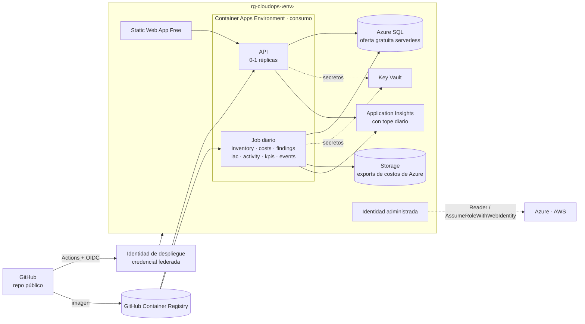
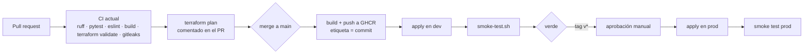

# 5. Infraestructura de la plataforma

Cómo debe desplegarse y operarse CloudOps Copilot cuando tenga recolectores, base de datos y varias nubes, manteniendo el costo casi en cero.

## Arquitectura de despliegue objetivo



## Componentes

| Componente | Hoy | Objetivo | Costo estimado/mes |
|---|---|---|---|
| API | Container App 0-1 réplicas | Igual | USD 0 (cupo gratuito de consumo) |
| Trabajo en segundo plano | Hilo dentro del API; pipeline con `subprocess` | **Container Apps Job** programado (cron diario) que ejecuta los recolectores en orden; reejecución manual | USD 0 dentro del cupo |
| Base de datos | No hay (JSON y JSONL en un File Share; Excel) | **Azure SQL Database, oferta gratuita** (serverless, 100.000 vCore-segundos y 32 GB al mes) | USD 0 |
| Secretos | Variable secreta en la Container App (Gemini) | **Key Vault** con referencias desde Container Apps vía identidad administrada | Centavos (cobro por operación) |
| Imagen | ACR de otro proyecto | **GitHub Container Registry** (gratis para repositorios públicos) | USD 0 |
| Exports de costos de Azure | No hay (API de consulta) | Export diario de Cost Management en FOCUS a una cuenta de almacenamiento | Centavos |
| Observabilidad | Ninguna (solo logs en vivo) | Application Insights con OpenTelemetry y **tope diario de ingesta** | USD 0-2 con el tope |
| Frontend | Static Web App Free | Igual, con cabeceras de seguridad (`staticwebapp.config.json`) | USD 0 |
| Estado de Terraform | Cuenta propia | Igual, con una llave por ambiente | Centavos |

**Total estimado:** por debajo de USD 5/mes para un ambiente con Azure y AWS en un tenant personal. Las organizaciones grandes pagarán sobre todo por lo que activen de forma opcional en sus propias cuentas (Security Hub, Config, Defender).

### Por qué Azure SQL con la oferta gratuita

| Opción | Costo/mes | A favor | En contra |
|---|---|---|---|
| **Azure SQL Database, oferta gratuita** | USD 0 | Gratis de por vida en la suscripción, backups incluidos, se pausa sola | Al reanudarse tras una pausa la primera consulta tarda; tope de 100.000 vCore-segundos al mes |
| PostgreSQL Flexible Server B1ms | ~USD 13 | PostgreSQL estándar, sin pausas | Costo fijo |
| SQLite en el File Share | USD 0 | Simple | SMB y SQLite no se llevan bien con escrituras concurrentes de varios jobs |
| Cosmos DB, nivel gratuito | USD 0 | Generoso | Modelo de documentos poco natural para agregados de costos e historia |

El acceso a datos se escribe con SQLAlchemy y migraciones de Alembic, sin SQL propietario: cambiar a PostgreSQL es configuración. El detalle está en el [ADR 0007](../adr/0007-almacen-de-datos-y-recolectores.md).

### Presupuesto de cómputo de la base de datos

La oferta gratuita incluye 100.000 vCore-segundos al mes. La base serverless consume mientras está activa y se pausa tras un periodo sin conexiones (del orden de una hora; el valor exacto se fija en la prueba de concepto). Con un mínimo de 0,5 vCore:

| Patrón de uso | vCore-segundos/mes | ¿Cabe en el cupo? |
|---|---|---|
| Recolector cada hora (la base nunca se pausa) | 0,5 × 3.600 × 720 ≈ **1.296.000** | No: 13 veces el cupo |
| Recolectores cada 6 h | 0,5 × 3.600 × 4 × 30 ≈ **216.000** | No |
| **Una ventana diaria** | 0,5 × 3.600 × 30 ≈ **54.000** | Sí |
| + ~20 sesiones de uso al mes, de una hora | + 36.000 → **~90.000** | Justo |

Por eso: ventana diaria única, inventario en vivo para la vista y lecturas del panel concentradas (una sesión despierta la base una vez, no por cada vista). Cuando el uso supere el cupo hay dos salidas sin cambiar código: pagar el excedente al precio serverless o pasar a PostgreSQL B1ms (~USD 13/mes, sin pausas). La cifra exacta se valida en la fase 1 midiendo el consumo real durante dos semanas.

El consumo se controla además con recolectores incrementales (solo cambios), agregados diarios precalculados y retención: costos diarios durante 13 meses y eventos de actividad durante 12 meses.

## Ambientes

| Ambiente | Para | Diferencias |
|---|---|---|
| `dev` | Cada PR mergeado a `main` | Escala a cero; datos de las cuentas de laboratorio |
| `prod` | Releases etiquetados (`v*`) | Aprobación manual en GitHub Environments; mismas cuentas reales |

Ambos comparten suscripción, pero tienen grupo de recursos, base de datos, app registrations y llave de estado propios. El código de Terraform se reorganiza así:

```
infra/
├── modules/
│   ├── platform/        Container Apps, jobs, SWA, observabilidad
│   ├── data/            Azure SQL, Key Vault, storage de exports
│   ├── identity/        identidad administrada, roles, app registrations
│   └── aws-onboarding/  OIDC, rol hub, StackSet, CUR, Resource Explorer
└── envs/
    ├── dev/
    └── prod/
```

## Despliegue continuo



- **Sin secretos en GitHub**: una identidad de despliegue con credencial federada para `repo:miguelortiz13@89714460/cloudops-copilot@1406664105:environment:prod` (formato inmutable del claim `sub` de GitHub).
- **Plan en el PR**: el revisor ve qué cambia en la infraestructura antes de aprobar.
- **Reversión**: Container Apps conserva revisiones; volver atrás es reactivar la anterior (o reetiquetar la imagen).
- **Migraciones de base de datos** como paso explícito antes de activar la nueva revisión.

## Observabilidad

| Señal | Implementación | Alerta |
|---|---|---|
| Errores y latencia del API | OpenTelemetry → Application Insights | 5xx > 5 % durante 10 min |
| Ejecución de recolectores | Tabla `collector_runs` + métrica personalizada | Dos fallos seguidos del mismo recolector |
| Frescura de los datos | Antigüedad del último dato por recolector y cuenta | Ventana diaria con más de 26 h; costos con más de 30 h |
| Límites de tasa | Contador de 429 por API y cuenta | Sostenidos durante 1 h |
| Costo de la propia plataforma | La plataforma se mide a sí misma (tag `Project=cloudops`) | Gasto mensual > USD 10 |

El tope diario de ingesta en Application Insights evita la sorpresa más común de la observabilidad en Azure: una factura de logs mayor que la de la aplicación.

## Red

Se mantiene el ingreso público con autenticación de Entra ID. Los endpoints privados para SQL y Key Vault se documentan como opción para organizaciones que lo exijan, sabiendo que suben el costo fijo.
