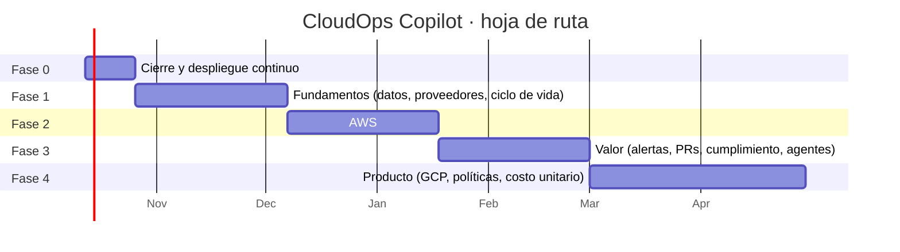

# 7. Hoja de ruta

Cinco fases. Cada una termina con algo usable y con criterios de salida verificables; ninguna empieza sin que la anterior cumpla los suyos. Las duraciones suponen una persona con dedicación parcial (unas 15 h por semana).

---

## Fase 0 · Cierre y despliegue continuo (2 semanas)

**Objetivo:** dejar lo actual cerrado, seguro y desplegándose solo.

| Entregable | Detalle | Estado |
|---|---|---|
| Merge de PRs #1, #2 y el de este plan | `main` refleja lo desplegado | Hecho (#1, #2, #3) |
| Verificación del inicio de sesión en el panel | Primer uso real de Entra ID en el navegador | Hecho |
| Remediación de los hallazgos abiertos del laboratorio | Vía Terraform del proyecto correspondiente, para que la plataforma los vea cerrarse | Fuera de alcance: los hallazgos son de otros proyectos y este plan solo cambia CloudOps Copilot |
| Imagen en GitHub Container Registry | Elimina la dependencia del ACR de otro proyecto | Hecho (v2.4.0) |
| Despliegue continuo con GitHub Actions + OIDC a `dev` | Build y publicación de la imagen, despliegue del API y del panel al hacer merge, smoke test | Hecho (v2.4.0). La infraestructura sigue aplicándose a mano con Terraform; el plan comentado en PRs pasa a la fase 1 |
| Escaneo de dependencias e imagen en CI | Dependabot, `pip-audit`, `npm audit`, Trivy | Hecho (v2.4.0) |
| Cabeceras de seguridad en el panel | `staticwebapp.config.json` | Hecho (v2.4.0) |

**Criterios de salida:** un merge a `main` despliega solo y pasa el smoke test; ningún secreto en GitHub; el panel abre con inicio de sesión.

**Costo incremental:** USD 0.

---

## Fase 1 · Fundamentos (6 semanas)

**Objetivo:** que la plataforma tenga memoria, un modelo independiente de la nube y procesos fuera del API. Es la fase menos vistosa y la que habilita todo lo demás.

| Entregable | Módulo | Detalle | Estado |
|---|---|---|---|
| Base de datos (Azure SQL gratuita) con SQLAlchemy y Alembic | Plataforma | Esquema del [modelo canónico](02-arquitectura-objetivo.md#modelo-canónico) | Hecho |
| Capa de proveedores con `AzureProvider` | Plataforma | Extraer de `services/` y `agents/azure_agent.py`; pruebas de contrato con fixtures | En curso: `AzureClient` extraído |
| Job diario de recolección | Plataforma | inventory, costs, findings, iac_states, activity, kpis | Hecho: inventario (con estado IaC y creador como campos del recurso), costos, hallazgos y KPIs |
| Inyección de dependencias con `Depends` | API | Reemplaza `get_services()[n]` | Hecho |
| Ciclo de vida de hallazgos | Seguridad / Hallazgos | Abierto, asumido, resuelto, aceptado con vencimiento | Automático hecho; falta la gestión manual (asumir, aceptar) |
| Catálogo de reglas con mapeo CIS / ISO | Seguridad / Cumplimiento | Las 7 reglas actuales, migradas | Iniciado: 7 reglas con id estable; falta el mapeo CIS/ISO |
| Costos desde la base, selector de periodo, comparación mes a mes | Costos | Export FOCUS de Azure Cost Management | |
| Clasificación ISO en la base (sin Excel) | Cumplimiento | | |
| Roles (lector, operador, administrador) y auditoría | Seguridad | App roles de Entra ID | |
| Interfaz de LLM y migración a `google-genai` | Agentes | Con límite de uso por usuario | |
| Administración: cuentas conectadas y estado de recolectores | Administración | Primera versión | |
| Pruebas de frontend (Vitest) y E2E con Playwright | Calidad | Capturas anonimizadas como regresión visual | |

**Criterios de salida:**
- El panel muestra 30 días de historia propia de inventario, costos y hallazgos.
- Un hallazgo corregido se marca resuelto solo.
- El job diario termina con éxito 14 días seguidos.
- El consumo de la base de datos queda medido y dentro del cupo gratuito, o con la decisión tomada.
- `azure_agent.py` deja de existir como pieza monolítica.

**Costo incremental:** USD 0-2/mes.

---

## Fase 2 · AWS (6 semanas)

**Objetivo:** paridad de los módulos principales con AWS en las mismas vistas.

| Paso | Entregable | Puerta |
|---|---|---|
| 1 | **Prueba de concepto de federación**: la identidad administrada asume un rol de AWS por OIDC | Si falla, se replantea la autenticación antes de seguir |
| 2 | Módulo `infra/aws-onboarding` (OIDC, rol hub, StackSet, CUR 2.0, Resource Explorer) | Se aplica sobre una organización de laboratorio |
| 3 | `AwsProvider.inventory` con tipos canónicos | Inventario multinube en las vistas |
| 4 | `AwsProvider.costs` sobre CUR 2.0 FOCUS + Athena | El total de un mes coincide con la factura (±1 %) |
| 5 | Reglas AWS del catálogo y recursos sin uso | Hallazgos AWS en la misma bandeja |
| 6 | Estados de Terraform en S3 con resolución de ARN | Cobertura de IaC por nube |
| 7 | Actividad desde CloudTrail | "Creado a mano" en AWS |
| 8 | Filtros por proveedor y cuenta en todo el panel | |
| 9 | Inventario de clústeres EKS | Página de Kubernetes con AKS y EKS |

**Criterios de salida:** una cuenta de AWS de laboratorio aparece en todas las vistas con datos reales; ninguna llave de AWS guardada; la factura de AWS del mes coincide con el panel.

**Costo incremental:** USD 1-3/mes (S3 y Athena del export en el laboratorio).

---

## Fase 3 · Valor (6 semanas)

**Objetivo:** que la plataforma avise, actúe y demuestre su valor.

| Entregable | Módulo |
|---|---|
| Motor de eventos y notificaciones (Teams, Slack, correo) con deduplicación | Integraciones |
| PR de remediación con bloque `import` (GitHub App) | IaC / Hallazgos |
| Anomalías estadísticas y pronóstico con estacionalidad | Costos |
| Seguimiento del ahorro realizado | Costos |
| Presupuestos con alertas | Costos |
| Vista de cumplimiento por control con excepciones | Cumplimiento |
| Agentes con herramientas, citas y conjunto de evaluación | Agentes |
| Página de Kubernetes y hallazgos de clúster | Kubernetes |
| Reporte ejecutivo mensual en PDF | Reportes |
| Bot de Teams con credencial federada | Integraciones |
| Bloque "Qué cambió" y "Mis pendientes" en el resumen | Resumen |

**Criterios de salida:** una anomalía sembrada genera alerta; un hallazgo genera un PR que pasa `terraform plan` sin cambios; el reporte mensual se envía solo; el agente supera el 90 % del conjunto de evaluación.

**Costo incremental:** USD 0-5/mes (costo del modelo de IA según uso).

---

## Fase 4 · Producto (continua)

Se prioriza según el uso real. Candidatos, en orden sugerido:

1. **GCP** como tercer proveedor.
2. **Políticas como código**: estado de Azure Policy, SCP y políticas de tags; generación de la política preventiva.
3. **Costo unitario** y reparto del gasto compartido.
4. **Drift** de recursos gestionados por Terraform.
5. Integración con tickets (Jira, Azure Boards, GitHub Issues).
6. Exposición por rutas (combinaciones de hallazgos).
7. Agente ligero dentro de clústeres privados.
8. Alcance por equipo (multiinquilino interno).
9. API pública con tokens de servicio.

---

## Riesgos del plan

| Riesgo | Probabilidad | Impacto | Mitigación |
|---|---|---|---|
| La federación Entra → AWS no funciona con el token de la identidad administrada | Media | Alto | Es el primer paso de la fase 2 y una puerta explícita |
| El cupo gratuito de Azure SQL no alcanza | Media | Bajo | Medido en la fase 1; salida a PostgreSQL B1ms sin cambiar código |
| La refactorización a proveedores rompe reglas existentes | Media | Alto | Pruebas de contrato + prueba de fidelidad KQL antes y después |
| Alcance excesivo para una persona | Alta | Medio | Fases con criterios de salida; la fase 4 se prioriza por uso |
| Los límites de tasa de las APIs de costos | Alta | Medio | Exports en lugar de APIs de consulta como fuente principal |
| Exponer datos reales en el repositorio público | Media | Alto | Capturas siempre anonimizadas; fixtures de pruebas sintéticos; gitleaks en CI |

## Cómo medir que la plataforma tiene valor

| Métrica | Fuente | Objetivo a 6 meses |
|---|---|---|
| Ahorro realizado acumulado | Seguimiento de ahorro | Mayor que el costo de la plataforma × 10 |
| MTTR de hallazgos críticos | Ciclo de vida | < 7 días |
| Cobertura real de IaC | Estados de Terraform | +20 puntos frente al inicio |
| Cumplimiento de tags obligatorias | Inventario | > 95 % |
| Gasto sin atribuir (sin tag de showback) | Costos | < 10 % |
| Hallazgos aceptados con vencimiento vigente | Ciclo de vida | 100 % (ninguno aceptado sin fecha) |

## Lo que queda fuera a propósito

- **Remediación automática.** La plataforma propone código; las personas lo aprueban. Es el [ADR 0001](../adr/0001-identidad-de-solo-lectura.md) y no cambia.
- **Reemplazar un CSPM o un SIEM.** Se integra con Defender, Security Hub o SCC en lugar de competir con ellos.
- **Gestión de despliegues.** No orquesta pipelines de aplicación; observa lo que dejan.
